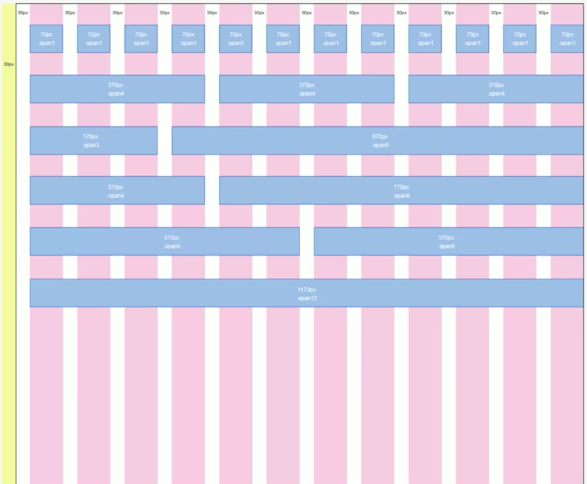
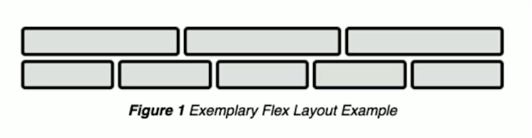
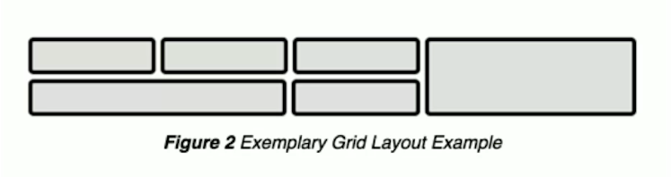

# CSS Grids and Flexbox for Responsive Web Design

## Responsive Design

1. Grid based design
2. Media Queries
3. Image that resizes

Note - No Javacript required

### Grid-based Design

<Details>
    <Summary>
        Click here for Grid-based design
    </Summary>
    
</Details>

### Images that Resize

Images that resize to big (when on desktop) and fast to download when on mobile

### Media Queries

Browser wil report screensize

## Float

**_If you float, you must clear_**

### Attributes Selectors

```ts
[class*="col-"] {

}
```

## Flex Box

Isn't designed to be rows, they are designed to be **_flex-wrap_**

<Details>
    <Summary>The problem with flex layout</Summary>
    The problem with flex layout is that one row is not directly related to the next
    
</Details>

## CSS Grid

<Details>
    <Summary>Layout with Grid</Summary>
    Grid is just similar to table, great for layout
    
</Details>

- Came out in Mar 2017
- Grid is for **_layout_**, flex for UI elements

### Layout

```tss
    .col-1 {
        grid-column: 1 / 2; // span line 1 - 2
        grid-row: 1 / 3;    // span line 1 - 3
    }
```
