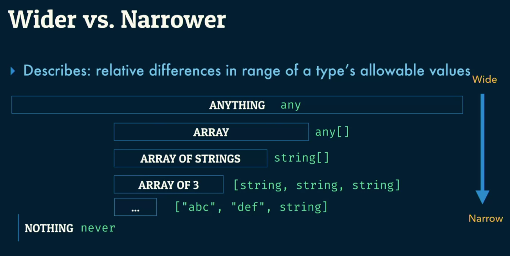

# Typescript

## Table of Contents

- [Typescript](#typescript)
  - [Table of Contents](#table-of-contents)
  - [Introduction](#introduction)
    - [Composed of 3 parts](#composed-of-3-parts)
    - [Benefits](#benefits)
  - [Basics](#basics)
    - [Variable](#variable)
    - [Variable Declations](#variable-declations)
    - [Array](#array)
    - [Combining Types](#combining-types)
  - [Interface & Type Aliases](#interface--type-aliases)
    - [Intersections & Union Types](#intersections--union-types)
    - [Type Systems](#type-systems)
    - [Functions](#functions)
      - [Overload Function Signatures](#overload-function-signatures)
    - [Type Aliases](#type-aliases)
    - [Interface](#interface)
      - [Call Signatures](#call-signatures)
  - [Classes](#classes)
    - [Access modifiers](#access-modifiers)
  - [Converting to Typescript](#converting-to-typescript)
    - [Step 1: Change all .js to .ts](#step-1-change-all-js-to-ts)
    - [Step 2: Ban implicit any](#step-2-ban-implicit-any)
    - [Part 3: Enable strict mode](#part-3-enable-strict-mode)
  - [Generics](#generics)
    - [Constraining Scope](#constraining-scope)

## Introduction

### Composed of 3 parts

1. Language
2. Language Server (this is the parts that integrates with your IDE and provides
   you IntelliSense)
3. Compiler (provide types checking and converts .ts to .js)

### Benefits

- Create design decisions
- Catch **spelling mistakes**
- Prevent runtime errors

## Basics

### Variable

**_String literal type_**

```ts
let x = "Hello World"; // x: string
```

```ts
const x = "Hello World"; // x: "Hello World"
```

### Variable Declations

```ts
let z; // z implicitly has type any
z = 41;
z = "abc";
```

```ts
let z: number;
z = 41;
z = "abc"; // error, because z: number
```

### Array

```ts
let a: number[] = [];
```

```ts
let a: number[] = [];
```

### Combining Types

```ts
let a: number | string;
```

## Interface & Type Aliases

Interface is basically named types

### Intersections & Union Types

```ts
export interface HasPhoneNumber {
  name: string;
  phoneNumber: number;
}

export interface HasAddress {
  name: string;
  address: string;
}

let contactInfo: HasPhoneNumber | HasAddress;
/* only contact.name has intellisense */

let contactInfo: HasPhoneNumber & HasAddress;
/* contact.name, contact.info, contact.address all has intellisense */
```

### Type Systems

Typescript is only concened about the structural type (the shape of the object).
Other languages like Java are concerned about the nominal type
(are these objects instances from this class?)

<Details>
    <Summary>Concept of wider vs narrower</Summary>
    
</Details>

### Functions

Always have a function return type because branches etc may change the return
type of the function

```ts
    function rename(name: string): string {
        ...
    }
```

#### Overload Function Signatures

```ts
function contactPeople(method: "email", ...people: HasEmail[]): void;

function contactPeople(method: "phone", ...people: HasPhoneNumber[]): void;
```

### Type Aliases

Type aliases is basically giving **a type a name**

```ts
const x: string | number; // anything on the RHS can be a type aliases
```

### Interface

The difference between Interface and type aliases is that Interface can only be
used on subtypes of Objects (functions and arrays)

#### Call Signatures

```ts
interface ContactMessenger {
  (contact: Email): void;
}
```

## Classes

This is for implementing an interface

```ts
export class Contact implements HasEmail {
  email: string;
}
```

### Access modifiers

1. `public` (everyone can sees it)
2. `protected` (only inherited classes can sees it)
3. `private` (only the class itself can sees it)

## Converting to Typescript

- Don't mix conversion to Typescript with functional changes
- Start out with weak types

### Step 1: Change all .js to .ts

1. Start with Cypress tests
2. Rename all .js to .ts files
3. Enable implicit any
4. Fix any errors (e.g. Javascript Classes)

### Step 2: Ban implicit any

1. Ban implicit any
2. Start to type it
   - Import from (@types/<package_name>) whenever possible
   - Other put any

### Part 3: Enable strict mode

```ts
strictNullChecks : true,
strict: true,
strictFunctionTypes: true,
strictBindCallApply: true
```

## Generics

Generics is a parameterised Type

```ts
interface WrappedValue<T = any> {
  value: T;
}
```

### Constraining Scope

```ts
interface WrappedValue<T extends { id: string }> {}
```

Extra note:
Curry function means that returning a function and invoking it immediately

```ts
function startTuple<T>(a: T) {
  return function finishTuple<U>(b: U) {
    return [a, b] as [T, U];
  };
}

const myType = startTuple(["first"])(42);
```
